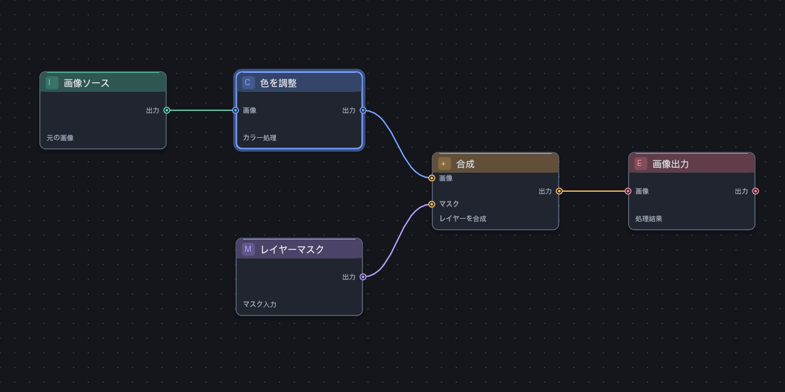
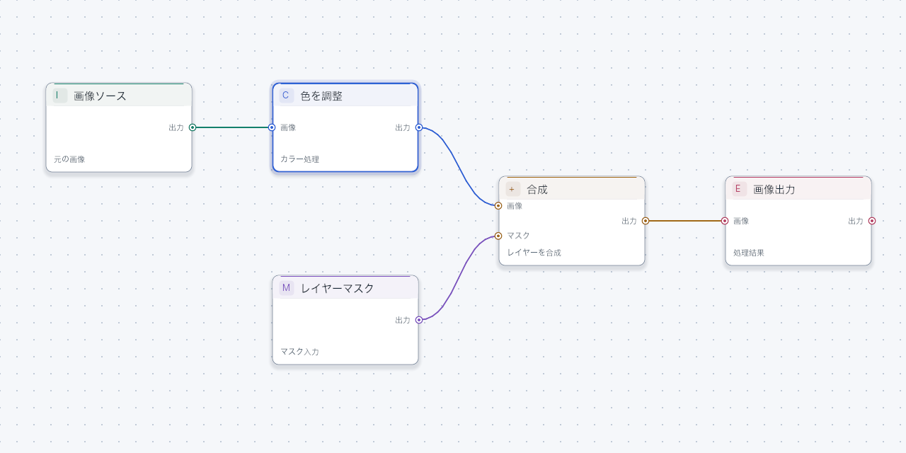

<!-- Hallmark · component scope · graphite canvas / blue selection / role accents.
Pre-emit critique: Philosophy 4, Hierarchy 4, Execution 4, Specificity 4, Restraint 5, Variety 3. -->
# ノードの表示デザイン

ユーザー提供の参考画像から、ドット背景、控えめな立体感、役割色、丸いPort、細い曲線、明瞭な選択枠を取り入れました。Rust/wgpuで描画し、Dark/Lightの両方に対応します。

- グラファイト色／明るいグレーの背景と、24 world units間隔のドット。遠景は120 unitsへ間引き。
- 10 unitsの角丸、通常1 unit／選択時2 unitsの枠、選択時の外側リング。
- 1インスタンスのSDFで描く薄い影。遠景では影・色帯・文字を省略。
- 上端の色帯、任意の短い記号、見出し、Port名、任意の補足文。
- 同じ中心位置を使う直径12 unitsのPortリング。Hit Testと接続座標は既存の `port_anchor` を使う。
- 接続線は送り元ノードの役割色を使用。丸い端を重ね、Bezier分割の継ぎ目を抑える。





## ホスト側で表示を指定する

`NodeLabels` は表示専用のRustメタデータです。Graph/Documentには保存しません。

```rust,ignore
use unge_render::{NodeLabels, NodeTone, LabelText};
let labels = NodeLabels {
    tone: NodeTone::Mint,
    symbol: "#".into(),
    title: LabelText { en: "Number".into(), ja: "数値".into(), zh_cn: "数值".into() },
    caption: LabelText { en: "Constant value".into(), ja: "定数値".into(), zh_cn: "常量值".into() },
    ..Default::default()
};
// LabelCatalogのtype_idキーへ登録し、Engine::set_labels(catalog)を呼ぶ。
```

`NodeTone` はNeutral / Blue / Mint / Violet / Amber / Rose。配色はThemePaletteに集約しており、Dark/Lightで同じ役割を維持します。用途固有の分類をcoreに埋め込まず、ホストが割り当てます。Neutralは既定の枠・接続色を使用します。

記号は最大2 Unicode文字、captionは既存ラベルと同じ最大256文字。記号は幅96・高さ120以上、captionはPort行と重ならない余白があるときだけ表示します。補足文は一行にクリップします。記号の対応フォントはホストが供給してください。サンプルはASCII記号でフォント依存を抑えています。文字は日本語・英語・简体中文の既存Glyph Atlasを利用します。

**Rust互換性:** NodeLabelsを全フィールド指定で構築する既存ホストはtone/symbol/captionを追加するか `..Default::default()` を併用してください。Document、既存Tauri IPC・ACXのwire型は維持しています。設定取得の追加APIは [PROPERTY_INSPECTOR.md](PROPERTY_INSPECTOR.md) を参照してください。

推奨サイズは幅208〜224、高さ128以上。既存の180×90ノードは同じ座標のまま簡略表示します。密なPort行や狭いカードで文字が重ならないよう、既存LOD/クリップも維持します。

選択・ドラッグ中の移動・有効/無効の接続プレビューは既存の実状態から描画します。実行中・成功・失敗・hover等の新しい状態表示は今回追加していません。無効な状態を見た目だけで装うことはありません。

## 実GPUの見本を生成する

```sh
cargo run --locked -p unge-render --example gallery -- /tmp/unge-gallery
cargo test --locked -p unge-render -- --ignored
```

Galleryは実際のSceneIndex/GpuRendererを使い、Dark/Light×3言語のPPM画像を出力します。画像処理ノードは描画用fixtureで、実行Backendの実装例ではありません。エンコード依存を増やさないためPPMを使い、macOSなら `sips -s format png input.ppm --out output.png` でPNGにできます。Tauriサンプルは実行可能な数値/加算ノードを左から右に配置した6ノード・5接続へ変更しました。

色はsRGB出力先を使ったGallery画像で確認し、ピクセル検証は従来の線形RGBA textureでも行います。影・Portリング・色帯で近景のQuad数は増えるため、既存の性能計測値はこのデザインのFPS保証にはなりません。新しい実GPU/Surfaceフレーム時間は未計測です。

## English

The Rust/wgpu node design adds a dot canvas, rounded cards, subtle SDF shadows, role-colored headers/ports/outgoing cables, and a blue selection ring. `NodeLabels` now accepts `tone`, a two-character `symbol`, and localized `caption`; use `..Default::default()` when migrating struct literals. Rendering and hit testing share the existing port anchors. Small/dense nodes omit ornaments and labels as needed. The gallery renders actual GPU output in both themes and three languages. It is a visual fixture, not an image-processing executor. Existing IPC/document formats are preserved; the additive property API is documented in PROPERTY_INSPECTOR.md; near-view instance counts increase and frame-time performance has not been remeasured.

## 简体中文

Rust/wgpu节点新增点阵背景、圆角卡片、轻微SDF阴影、按角色着色的标题/端口/输出连线及蓝色选择外框。`NodeLabels` 支持 `tone`、最多两个字符的 `symbol` 及三语言 `caption`；迁移结构体初始化代码时可使用 `..Default::default()`。绘制与命中测试沿用相同端口坐标。小尺寸及密集节点按需省略装饰/文字。Gallery通过真实GPU生成两种主题、三种语言的图片，仅为绘制示例。既有IPC/文档格式保持兼容，新增属性API见PROPERTY_INSPECTOR.md，近景实例数量增加，尚未重新测量帧时间。
